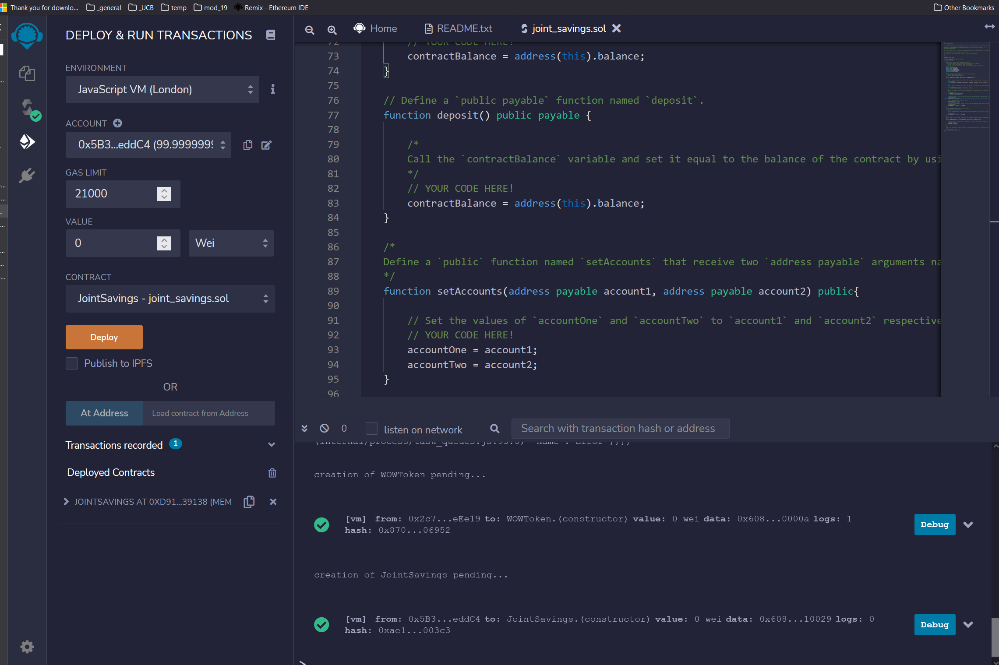
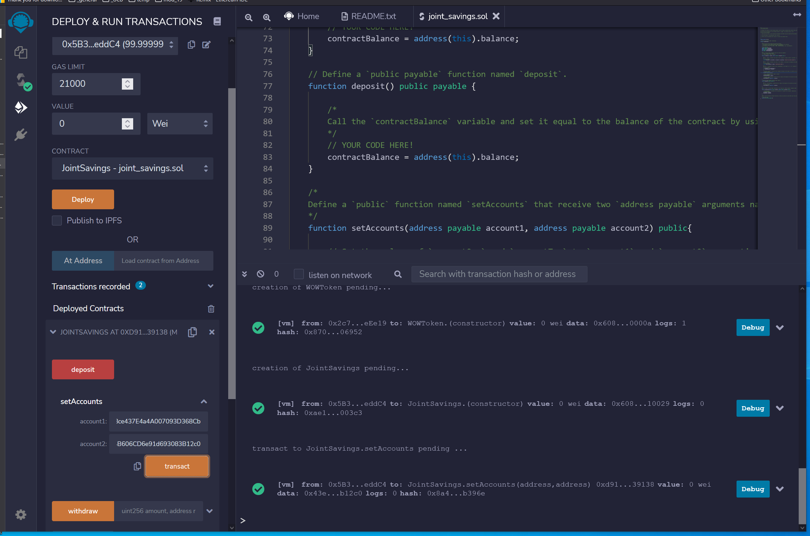
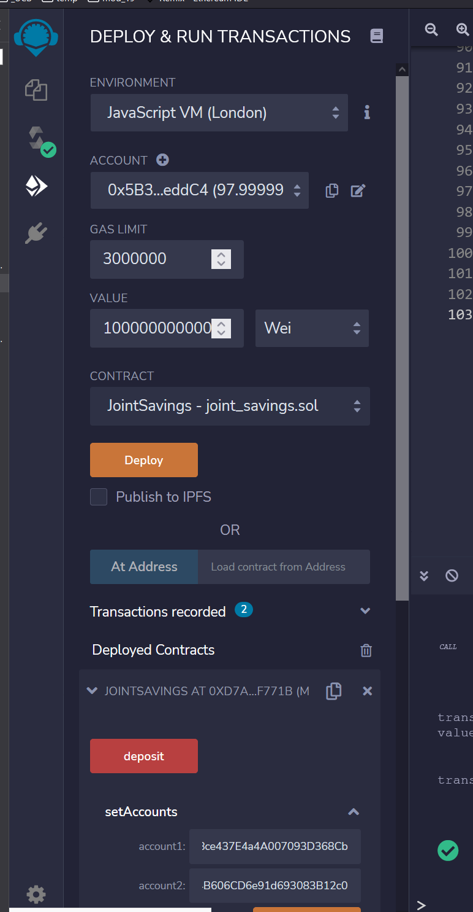
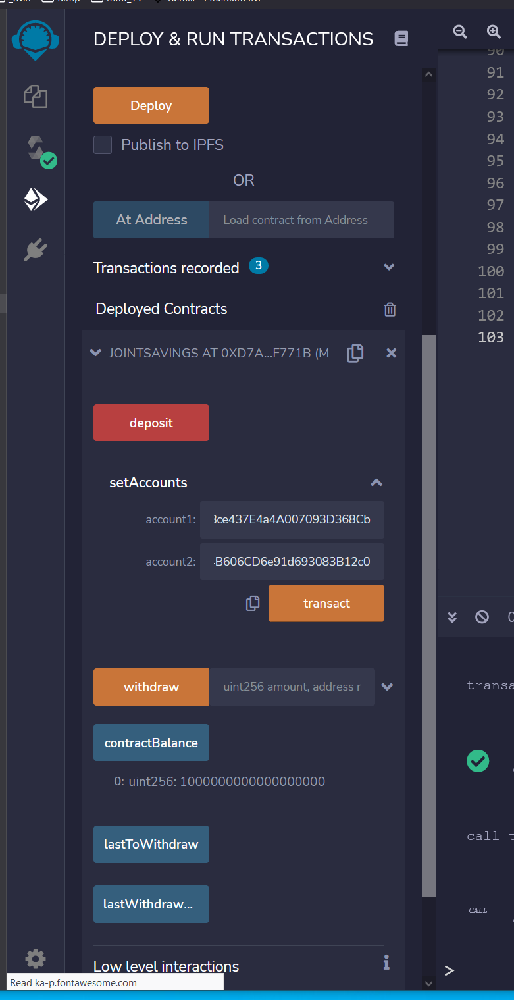
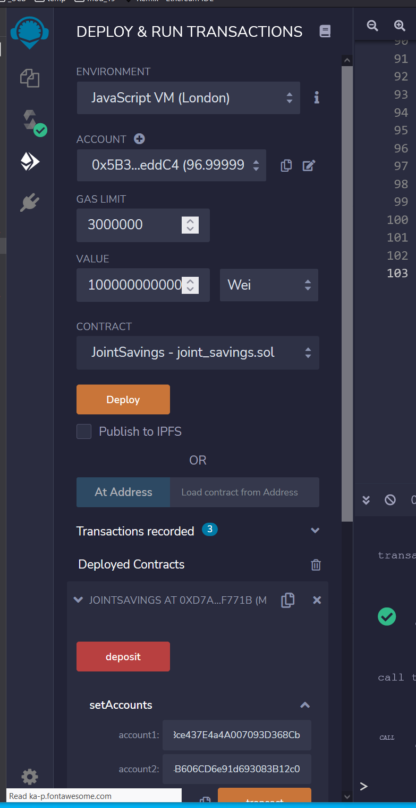
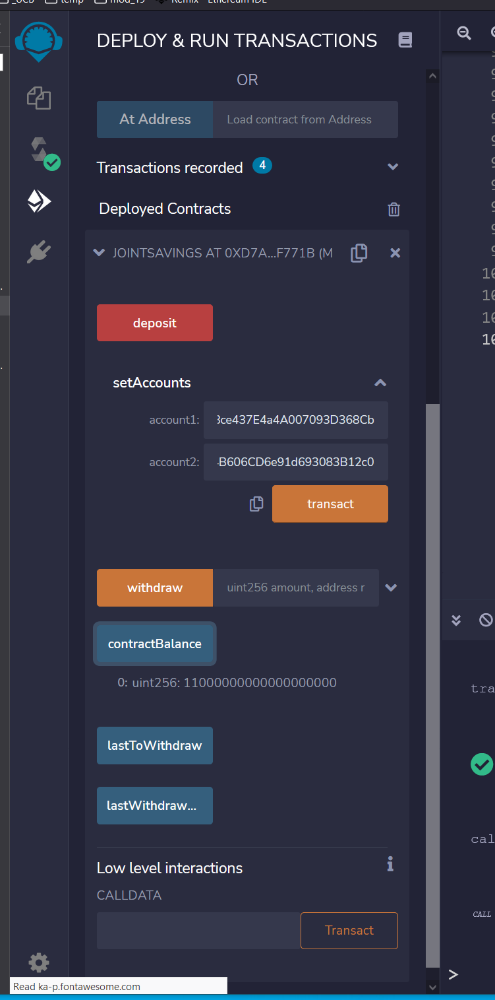
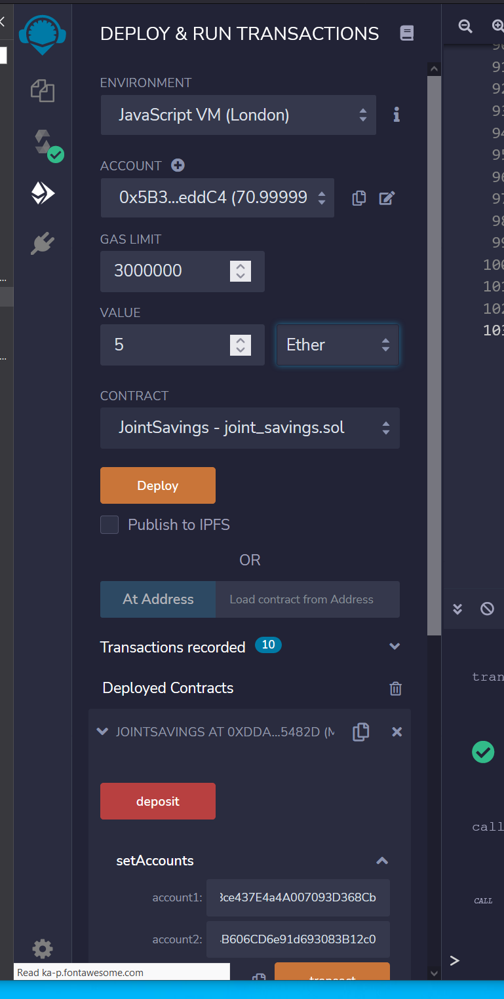
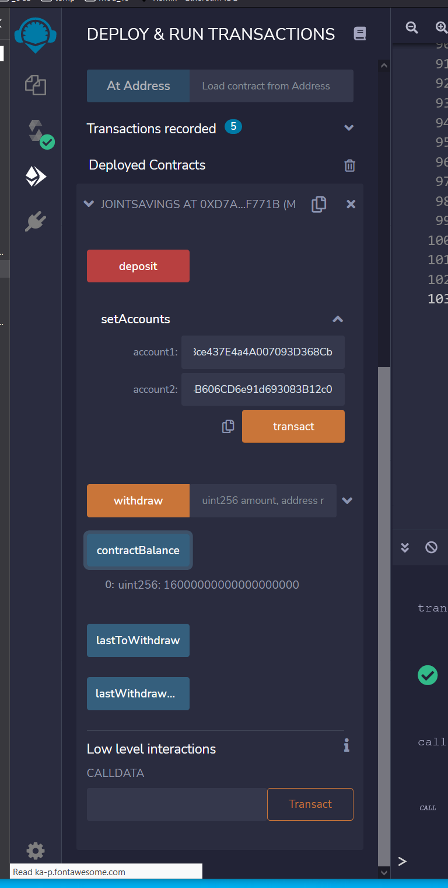
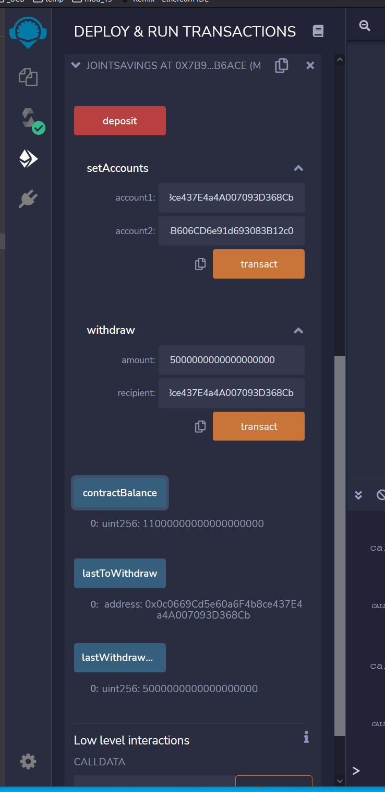
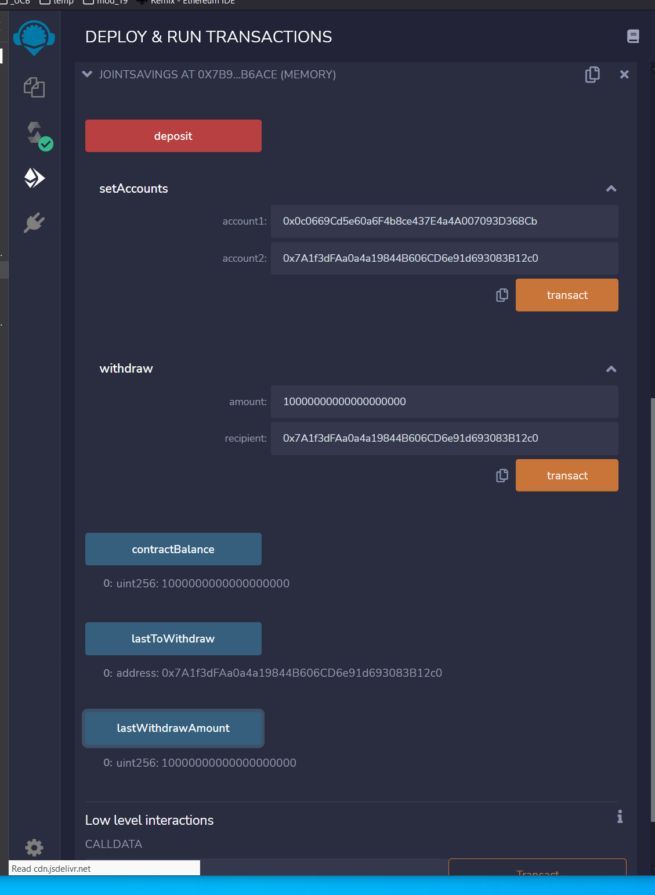

# *Smart Contract - (m20_challenge_01):*  

## **Description:** 
A fintech startup company has recently hired you. This company is disrupting the finance industry with its own cross-border, Ethereum-compatible blockchain that connects financial institutions. Currently, the team is building smart contracts to automate many of the institutions’ financial processes and features, such as hosting joint savings accounts.
 
To automate the creation of joint savings accounts, you’ll create a Solidity smart contract that accepts two user addresses. These addresses will be able to control a joint savings account. Your smart contract will use ether management functions to implement a financial institution’s requirements for providing the features of the joint savings account. These features will consist of the ability to deposit and withdraw funds from the account.
 
 

### ***Task 1:*** 
Create a Joint Savings Account Contract in Solidity.
 
### ***Task 2:*** 
Compile and Deploy Your Contract in the JavaScript VM.
 
### ***Task 3:*** 
Interact with Your Deployed Smart Contract.
 
 

## <U>Screenshots</U>: 
 
 
Successful Deployment:
 

 
 

Account Setup:
 

 
 

Ttransaction ONE - Initial & Final:
 

 
 

 
 

Ttransaction TWO - Initial & Final:
 

 
 

 
 

Ttransaction THREE - Initial & Final:
 

 
 

 
 

Withdraw Into Account ONE - Final:
 

 
 

Withdraw Into Account TWO - Final:
 

 
 

## <U>Technologies</U>: 
 
The following packages and dependicies are needed for the proper functioning of the application:
 
<b>
ReMix IDE: (https://remix.ethereum.org) 
Solidity: 
</b>
 

---

## Usage

In order to run the program, copy and paste the code in the 'joint_savings.sol' file into the online "Remix-Ethereum IDE" (link given above). Compile the solidity code in ReMix IDE and deploy and run.

---

## Contributors

**Name:** Saeed A Raghib 
**Contact:** saeed_raghib@msn.com

---

## License

### Universit of California at Berkeley EXTENSION